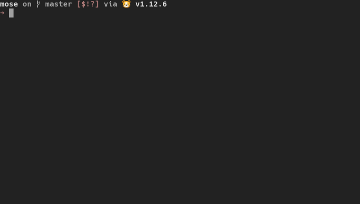
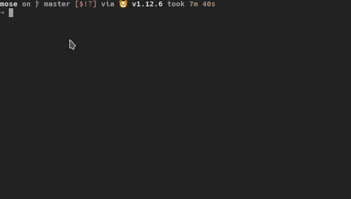

# MOSE (Master Of SErvers)
[](https://defcon.org/html/defcon-27/dc-27-speakers.html#Grace)
[](https://github.com/master-of-servers/MOSE/blob/master/LICENSE)
[](https://dev.azure.com/jaysonegrace/MOSE/_build/latest?definitionId=5&branchName=master)

> Copyright 2019 National Technology & Engineering Solutions of Sandia, LLC (NTESS).
Under the terms of Contract DE-NA0003525 with NTESS, 
the U.S. Government retains certain rights in this software

MOSE is a post exploitation tool that enables security professionals with little or no experience with configuration management (CM) technologies to leverage them to compromise environments. CM tools, such as [Puppet](https://puppet.com/) and [Chef](https://www.chef.io/), are used to provision systems in a uniform manner based on their function in a network. Upon successfully compromising a CM server, an attacker can use these tools to run commands on any and all systems that are in the CM server’s inventory. However, if the attacker does not have experience with these types of tools, there can be a very time-consuming learning curve. MOSE allows an operator to specify what they want to run without having to get bogged down in the details of how to write code specific to a proprietary CM tool. It also automatically incorporates the desired commands into existing code on the system, removing that burden from the user. MOSE allows the operator to choose which assets they want to target within the scope of the server’s inventory, whether this is a subset of clients or all clients. This is useful for targeting specific assets such as web servers, or choosing to take over all of the systems in the CM server’s inventory.

## MOSE + Puppet


## Mose + Chef


## Dependencies
You must download and install the following for MOSE to work:

 - [Golang](https://golang.org/) - specifically go1.12.7
 
 **Be sure to properly set your GOROOT, PATH and GOPATH env vars**
 - [Docker](https://docs.docker.com/install/) - tested with 18.09.2, build 6247962

## Getting started
Install all go-specific dependencies and build the binary:
```
make build
```
### Usage
```
Usage of ./mose [options]:
  -a string
        Architecture that the target CM tool is running on. (default "amd64")
  -c string
        Command to run on the targets.
  -ep int
        Port used to exfil data from chef server (default 443 with ssl, 9090 without) (default 443
  -f string
        Store binary at <filepath>
  -fu string
        File upload option
  -l string
        Local IP Address.
  -m string
        Name for backdoor payload (default "my_cmd")
  -ns
        Disable serving of payload
  -o string
        Operating system that the target CM tool is on. (default "linux")
  -p int
        Port used to serve payloads on (default 443 with ssl, 8090 without) (default 443)
  -rhost string
        Set RHOST for /etc/hosts of docker container (format is hostname:ip)
  -s string
        Json file to load for mose (default "settings.json")
  -ssl
        Serve payload over TLS
  -t string
        Configuration management tool to target. (default "puppet")
  -tts int
        Number of seconds to serve the payload (default 60)
  -v    Display verbose output
  ```

### TLS Certificates

**WARNING: You should generate and use a TLS certificate signed by a trusted Certificate Authority**

A self-signed certificate and key are provided for you, although you really shouldn't use them. This key and certificate are widely distributed, so you can not expect privacy if you do choose to use them. They can be found in the  `data` directory.

### Examples
You can find a couple of examples of how to run MOSE in [EXAMPLES.md](EXAMPLES.md)

### Test Labs
You can find test labs that can be run with MOSE at the following locations:

 - https://github.com/master-of-servers/puppet-test-lab
 - https://github.com/master-of-servers/chef-test-lab

### Credits
The following resources were used to help motivate the creation of this project:

 - https://n0tty.github.io/2017/06/11/Enterprise-Offense-IT-Operations-Part-1/
 - http://www.ryanwendel.com/2017/10/03/cooking-up-shells-with-a-compromised-chef-server/
